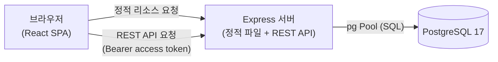
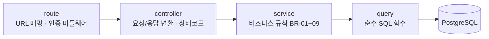
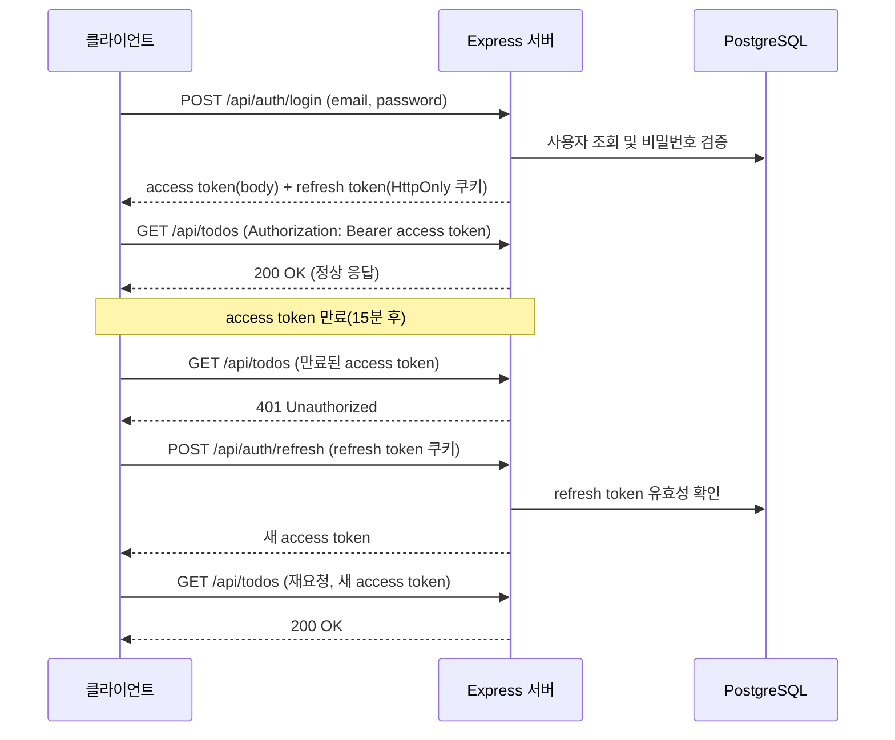
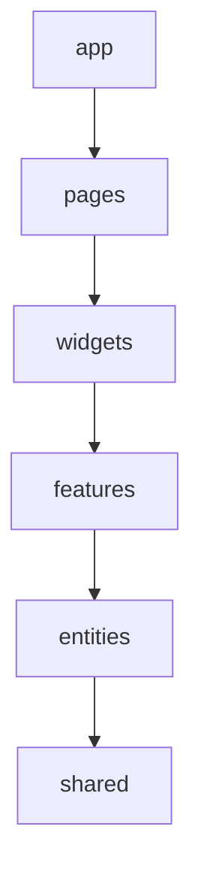

# TodoList 아키텍처 다이어그램

## 버전 이력

| 버전  | 날짜       | 변경 내용 | 변경 사유 |
| ----- | ---------- | --------- | --------- |
| 0.1.0 | 2026-08-26 | 최초 작성 | -         |

## 목차

1. 시스템 구성도
2. 백엔드 레이어 다이어그램
3. 인증 흐름 시퀀스 다이어그램
4. 프론트엔드 FSD 레이어 의존 방향 다이어그램

---

## 1. 시스템 구성도

브라우저가 단일 Express 서버에 접속하면, 이 서버가 정적 파일(React 빌드)과 REST API를 함께 서빙하고 PostgreSQL에 접근한다(PRD §6).

## 2. 백엔드 레이어 다이어그램

요청은 route → controller → service → query 순으로만 흐른다. 계층 건너뛰기는 금지된다(5-project-principle.md §2.2).

## 3. 인증 흐름 시퀀스 다이어그램

로그인 시 access/refresh token을 함께 발급하고, access token 만료 시 refresh token으로 재발급 후 원 요청을 재시도한다(PRD §5, §7).

## 4. 프론트엔드 FSD 레이어 의존 방향 다이어그램

상위 레이어는 바로 아래 레이어만 참조할 수 있는 단방향 의존 구조다(5-project-principle.md §2.1).

