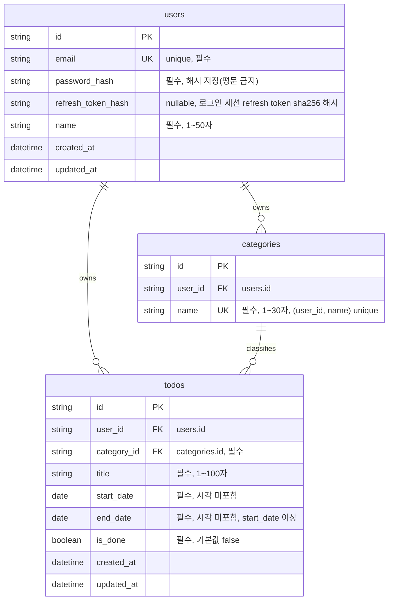

# TodoList ERD

## 버전 이력

| 버전  | 날짜       | 변경 내용 | 변경 사유 |
| ----- | ---------- | --------- | --------- |
| 0.1.0 | 2026-08-26 | 최초 작성 | -         |
| 0.2.0 | 2026-08-27 | users.refresh_token_hash 컬럼 추가(BE-03 refresh token 무효화용) | BE-03 구현 반영 |

## 목차

1. ERD 다이어그램
2. 관계 부연 설명

---

## 1. ERD 다이어그램

## 2. 관계 부연 설명

- `users`-`categories`, `users`-`todos`, `categories`-`todos`는 모두 1:N.
- 회원가입 시 서버가 해당 사용자의 '기본' `categories` 행을 자동 생성한다(BR-09). 모든 사용자는 최소 1개의 '기본' 카테고리를 보유한다.
- '기본' 카테고리는 삭제 불가. '기본'이 아닌 카테고리 삭제 시 소속 `todos.category_id`는 '기본' 카테고리로 재배정된다(BR-08).
- 로그아웃 시 NULL로 초기화되어 이전 refresh token이 무효화된다(단일 세션 가정).
- Todo 상태(시작전/진행중/완료/지연)는 `start_date`/`end_date`/`is_done`과 조회 시점의 오늘 날짜로 매번 파생 계산되는 값이라 `todos` 테이블에 상태 컬럼을 두지 않는다(도메인 정의서 §5).
